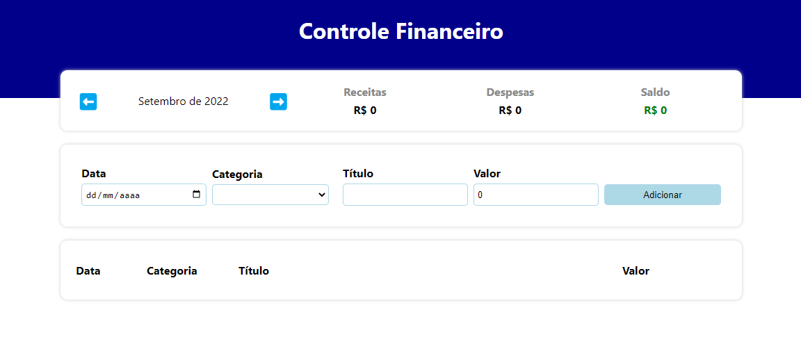

<p align="center">
  

  
  
  <a href="https://github.com/cadufc91/controle-financeiro/commits/master">
    
  </a>
    
   
   <a href="https://github.com/cadufc91/controle-financeiro/stargazers">
    
  </a>  
 
</p>
<h1 align="center">
    
</h1>

<h4 align="center"> 
	🚧  Controle Financeiro ♻️ <a href="http://controle-financeiro-xi.vercel.app/">Concluído</a> 🚀 🚧
</h4>

<p align="center">
 <a href="#-sobre-o-projeto">Sobre</a> •
 <a href="#-funcionalidades">Funcionalidades</a> •
 <a href="#-como-executar-o-projeto">Como executar</a> • 
 <a href="#-tecnologias">Tecnologias</a> • 
 <a href="#-contribuidores">Contribuidores</a> • 
 <a href="#-autor">Autor</a> • 
 <a href="#-licença">Licença</a>
</p>


## 💻 Sobre o projeto

Controle Financeiro é um projeto desenvolvido para o controle mensal das suas despesas e receitas, seja para pessoas jurídica ou pessoa física.

---

## ⚙️ Funcionalidades

- [x] Empresas ou indivíduos podem inserir suas receitas e despesas mensais:
  - Salário
  - Aluguel
  - Alimentação 
  - Luz
- [x] Os usuários tem acesso a uma listagem com todos os dados inseridos
- [x] No topo é apresentado um resumo com o total de receitas e despesas daquele mês e um saldo 

---

## 🚀 Como executar o projeto

Este projeto foi desenvolvido somente o Front End.

### Pré-requisitos

Antes de começar, você vai precisar ter instalado em sua máquina as seguintes ferramentas:
[Git](https://git-scm.com), [Node.js](https://nodejs.org/en/). 
Além disto é bom ter um editor para trabalhar com o código como [VSCode](https://code.visualstudio.com/)

#### 🧭 Rodando a aplicação web (Frontend)

```bash
# Clone este repositório
$ git clone https://github.com/Cadufc91/controle-financeiro.git
# Vá para a pasta da aplicação Front End
$ cd controle-financeiro
# Instale as dependências
$ npm install
# Execute a aplicação em modo de desenvolvimento
$ npm run start
# A aplicação será aberta na porta:3000 - acesse http://localhost:3000
```

---

## 🛠 Tecnologias

As seguintes ferramentas foram usadas na construção do projeto:

#### **Website**  ([React](https://reactjs.org/)  +  [TypeScript](https://www.typescriptlang.org/))

-   **[Styled Components](https://github.com/styled-components/styled-components)**

> Veja o arquivo  [package.json](https://github.com/cadufc91/controle-financeiro/blob/master/web/package.json)

**Utilitários**
-   Editor:  **[Visual Studio Code](https://code.visualstudio.com/)** 
-   Markdown:  **[StackEdit](https://stackedit.io/)**,  **[Markdown Emoji](https://gist.github.com/rxaviers/7360908)**


---

## 👨‍💻 Contribuidores

<table>
  <tr>
    <td align="center"><a href="https://cadufc-portfolio.vercel.app/"><br /><sub><b>Cadu Fernandes</b></sub></a><br /><a href="https://cadufc-portfolio.vercel.app/">👨‍💻</a></td>
  </tr>
</table>

## 💪 Como contribuir para o projeto

1. Faça um **fork** do projeto.
2. Crie uma nova branch com as suas alterações: `git checkout -b my-feature`
3. Salve as alterações e crie uma mensagem de commit contando o que você fez: `git commit -m "feature: My new feature"`
4. Envie as suas alterações: `git push origin my-feature`

## 🦸 Autor

<a href="https://cadufc-portfolio.vercel.app/">
 
 <br />
 <sub><b>Cadu Fernandes</b></sub></a> <a href="https://cadufc-portfolio.vercel.app/">🚀</a>
 <br />

 [](https://www.linkedin.com/in/carloseduardo-fernandes/) 
[](mailto:fernandes.cadu@gmail.com)

---

## 📝 Licença

Este projeto esta sobe a licença [MIT](./LICENSE).

Feito com ❤️ por Cadu Fernandes 👋🏽 [Entre em contato!](https://www.linkedin.com/in/carloseduardo-fernandes/)

---

##  Versões do README

[Português 🇧🇷](./README.md)  |  [Inglês 🇺🇸](./README-en.md)
